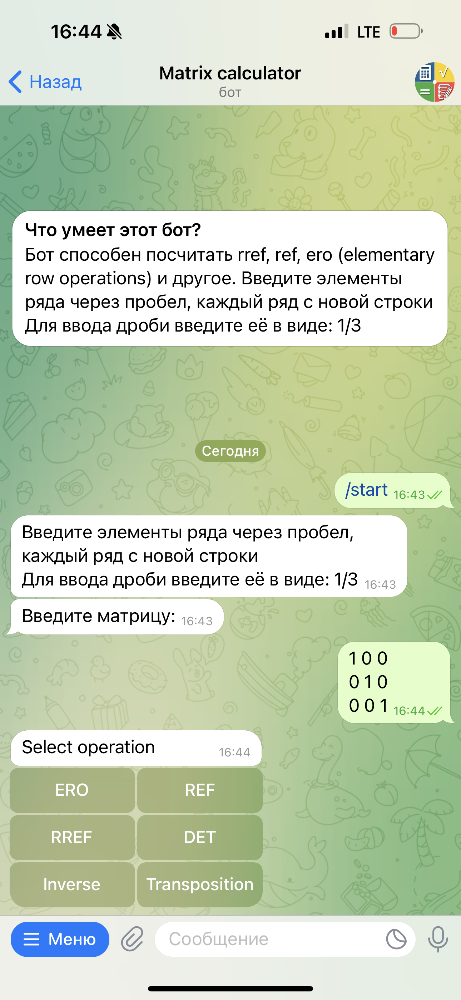
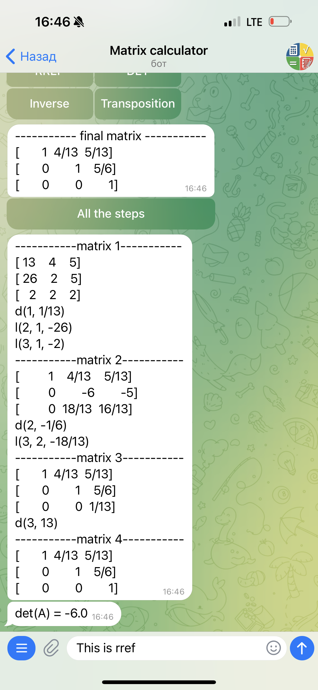
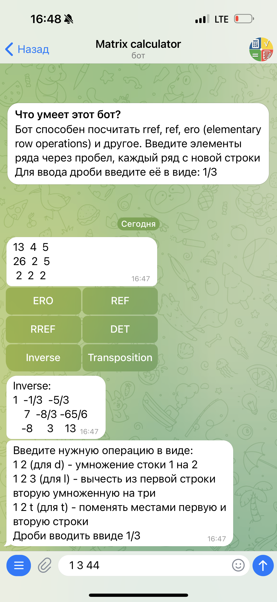
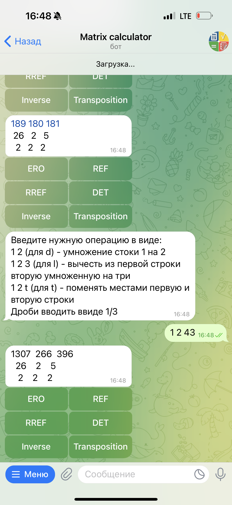

# Matrix Bot for Linear Algebra Calculations

Welcome to the Matrix Bot project! This Python bot is designed to handle various matrix operations essential for linear algebra. 

## Functionality

The bot includes the following features:
- **REF (Row Echelon Form) Calculation:** Converts a matrix into its row echelon form.
- **RREF (Reduced Row Echelon Form) Calculation:** Transforms a matrix into its reduced row echelon form.
- **Determinant Calculation:** Computes the determinant of a matrix.
- **Trace Calculation:** Calculates the trace of a matrix.
- **Inverse Calculation:** Finds the inverse of a matrix.
- **Transposition:** Transposes a given matrix.
- **ERO:** the bot allows the utilization of elementary row operations up to the third order, enhancing its versatility in matrix transformations.

## Additional Features

- The bot utilizes Pandas for certain operations.
- It supports the input of fractions, and the calculator automatically converts non-integer answers into fractions.
- Elementary row operations can be applied to matrices of all sizes.

## How to Use

1. Run the bot and follow the provided instructions to input your matrices or operations.
2. Choose the operation you wish to perform and input the required data.
3. View the output directly in the bot's interface.

## Screenshots

Include screenshots or visuals of the bot in action here.

Feel free to explore the functionalities of this Matrix Bot for all your linear algebra needs! 

    
    
    
    

If you encounter any issues or have suggestions for improvements, please let us know. 🚀

